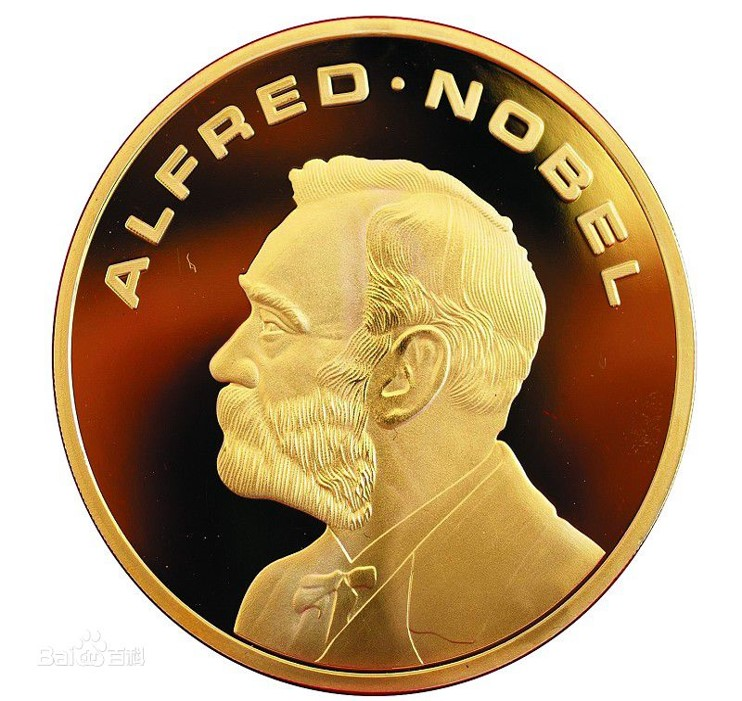
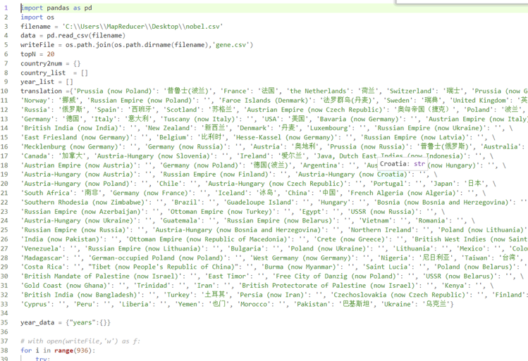
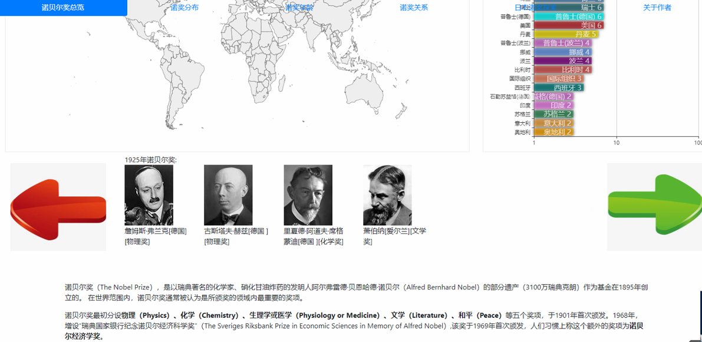
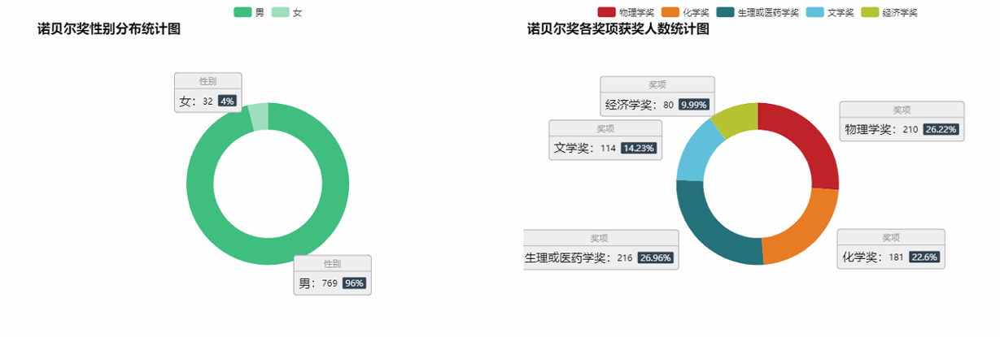
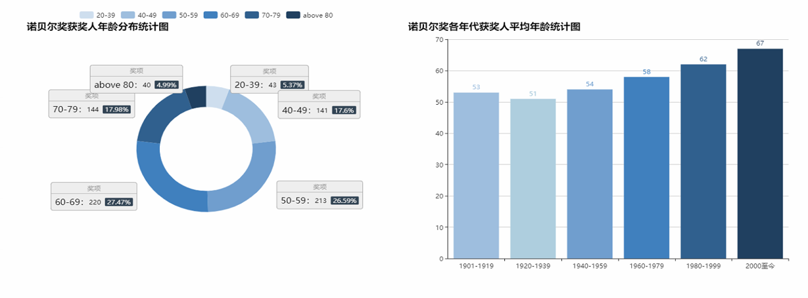
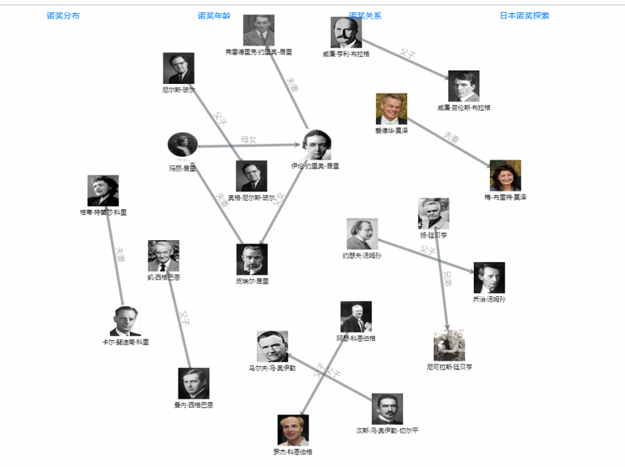
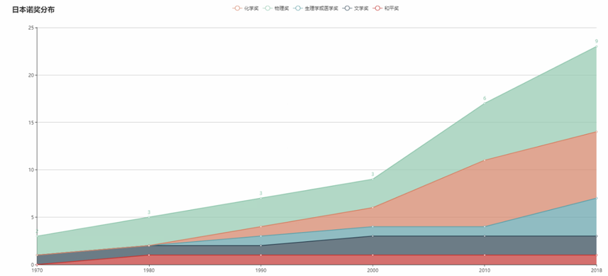
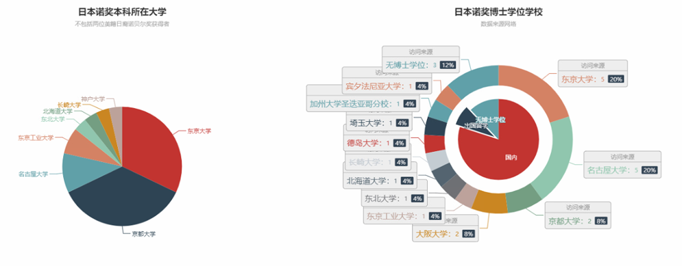

# Vis Final Project
这是数据可视化的大作业--诺贝尔奖可视化，由[shiyi001](https://github.com/shiyi001),[dhx000](https://github.com/dhx000),[zhao1liang](https://github.com/zhao1iang)协作完成。

# 
诺贝尔奖可视化
 
## 
Group 9 郑良锋 赵亮 董和鑫

## 数据概要
### 数据背景

	

诺贝尔奖是以瑞典著名化学家，硝化甘油炸药的发明人硝化甘油炸药的发明人阿尔弗雷德·贝恩哈德·诺贝尔（Alfred Bernhard Nobel）的部分遗产（3100万瑞典克朗）作为基金在1895年创立的。 在世界范围内，诺贝尔奖通常被认为是所颁奖的领域内最重要的奖项。 

诺贝尔奖数量代表一个国家在这个研究领域的研究实力以及影响力，如日本就在二十一世纪初为振兴科研，提出了一诺贝奖为指标的科研目标：50年拿30个诺贝奖。

因此对诺贝尔奖数据进行可视化具有很强的现实意义。比如，我们可以看到国家科研实力的变化，诺贝尔奖获奖者的性别，平均年龄
等等，也能反映高级科研人员的性别年龄构成。

因此我们这次可视化分析报告选取诺贝尔奖可视化这一主题，希望通过我们分析，能让您看到一些诺奖背后的一些有意思的东西。

### 数据获取

我们主要对维基百科，百度百科，数字说，以及从前的一些诺奖可视化作品中获得数据，直接爬取数据并不能满足我们的需要，我们还使用python对数据进行了处理，
获得我们需要的json文件。

	

### 数据描述

我们获取的数据包括历年诺奖获得者的国籍，获奖年龄，性别，获奖类别，获奖原因等基本信息，对于一些获奖者，我们搜集了他们的毕业院校，亲属关系等信息，上述信息中，
除年龄属性为定量属性，其他均为定类属性。

### 数据初步分析
我们获得的数据有历年诺奖获得者的国籍，年龄，性别，获奖原因等信息，通过分析国籍信息我们可以得到，法国在二战之前获得诺奖最多，美国在二战之后诺奖出现了井喷，所以想要了解各个年份，获得诺奖最多的前二十国家分别有什么变化，以此得到各个国家科研实力变化的情况，其次结合我们的先验知识，比如战争和经济增长对国家诺奖数量的影响。

## 设计准则
我们根据当前主题，分析需求，总结为以下几点：

- 1.用户最想了解一百多年来哪些国家哪些个人获得了何种诺奖，哪个国家获奖最多，各国获奖变化趋势等，根据“概览优于细节”的原则，我们决定先对以上部分做一个概览的呈现。

- 2.用户看到了诺奖的概览信息后，想要知道一些统计信息，如性别，各奖获奖人数，获奖平均年龄等信息。

- 3.挖掘一些有趣的关系，如诺奖获得者之间的亲属关系。

- 4.在看到各国获奖趋势变化后，用户可能会对某些国家的获奖情况产生疑问，我们要以国家为对象，分析其获奖趋势变化的原因；
这里我们以日本为对象，分析其近20年来，诺奖"井喷"现象的原因。

## 可视化设计
针对上一节中的设计准则，本节对其进行可视化实现。

###分析流程图

###可视化结果
按照设计需求，我们将可视化任务分为五个部分：诺奖总览，诺奖分布，诺奖年龄，诺奖关系和日本诺奖探索，通过网页头部的导航来切换。

#### 诺奖总览

我们设计了两种诺奖总览方式。排名总览显示每一年获得诺奖最多的20个国家，为了方便显示我们对数据取log以后显示；地图总览显示不同年份获得诺奖者所在的国家，不同的诺奖类别用不用颜色显示，如果一个国家同年有多个诺奖，那么会在这个国家内选取不同的城市来显示表示诺奖的点；此外，我们还统计了该年的诺奖获得者信息，以图片+姓名+国籍+奖项的格式加以呈现。

为了完成和用户的交互，我们设计了使用前向后向箭头点击的方式切换年份。如果用户不点击，数据将以2秒的频率向前移动。同时显示当年获得诺奖学者的照片以及获奖者的基本信息。

#### 诺奖分布

诺贝尔奖最初分设物理（Physics）、化学（Chemistry）、生理学或医学（Physiology or Medicine）、文学（Literature）、和平（Peace）等五个奖项，于1901年首次颁发。1968年，增设“瑞典国家银行纪念诺贝尔经济科学奖”（The Sveriges Riksbank Prize in Economic Sciences in Memory of Alfred Nobel）,该奖于1969年首次颁发，人们习惯上称这个额外的奖项为诺贝尔经济学奖。

诺贝尔和平奖的颁发一直存在争议，故不再本次可视化的统计范围之内；除此之外的其他奖项，至2018年，共有801人获奖，其中男性占绝大多数(96%),可见男性在科学和医学的顶尖领域占有绝对地位，而由于诺贝尔奖中的科学类奖项往往是颁发给几十年前发现的重要成果，故这种性别的不均衡现象也体现了当年的科学界存在性别歧视的现象。

#### 诺奖年龄

诺奖得主的年龄变化也颇为有趣，在最初的二十年，50岁左右的获奖者也不鲜见。而威廉·劳伦斯·布拉格在25岁就获得了诺贝尔物理奖。而进入上世纪60年代，获得诺奖的平均年龄有了明显的增长趋势。这也是因为诺奖往往是颁发给几十年前发现的重要成果，而这种“滞后效应”随着时间的推移不断的累积，故才会使得获奖的平均年龄越来越高。

#### 诺奖关系

我们还挖掘了诺贝尔奖获得者的亲属关系，其中最为瞩目的是居里一家，共获得了五次诺奖，其中居里夫人(玛丽·居里）获得了两次，丈夫(皮埃尔·居里)获得了一次，女儿获得一次，女婿获得一次。

#### 日本诺奖探索

日本与我们国家一衣带水，人种相似，文化相似，教育方式相似，但是进入21世纪以后，日本疯狂获得18个诺奖，而中国依然是“一奖难求”，因此分析日本的诺奖数据具有很强的现实意义。

日本曾在2001年放下豪言，为了提高日本的科研实力，决定制定一项科学目标：50年内要拿30个诺贝奖。许多人以为其是天方夜谭，毕竟日本在100余年的历史中也只有8个诺奖，其中自然科学奖只有5个，50年30个诺奖和其不容易。许多人也等着看日本的笑话，可自从这项计划制定依赖，令所有人大跌眼镜的是，日本竟然在此后的18内拿到了18个诺贝尔奖，且其中全部都是自然科学奖，根据数据显示，在21世纪第一个十年物理学奖和化学奖爆发增长，化学奖和物理学奖一般都需要数十年的基础科学研究才积累以及政府的巨额投入才能得来，证明了20世纪60年代以后日本对科学的巨额到达入到了收获期。在21世纪的第二个十年中，物理和化学奖继续增长的同时，生物和医学奖也开始大量增长。自此，日本50年30个诺奖的目标已经完成了大半，日本也被外界承认为“智造大国”。

首先,日本最近20年获得的诺奖都是自然科学奖，这与其之前三十年的巨量的经济增长不无关系，同时可以看到，日本诺奖获得者，本科所在学校中东京大学和京都大学的最多，说明这两所高校育人实力非常强劲，博士学位也仅有两人是在国外获取的，说明日本本科教育与博士教育相对均衡，于此相比，中国许多优秀的学生第一选项是去国外深造，由此可见我们高等教育的发展还距日本有一定的差距，如果有一天我们最优秀的学生选择留在北大清华深造，那恐怕这天就是我们国家真是是诺奖大国的时候了。

## 难点与挑战

### 主要难点
- 1.数据严重不足

- 2.要对信息进行动态展示，给与用户较好的交互体验，实现难度较大。

- 3.如果提高可视化的趣味性。

- 4.如何多层次的展示信息

### 解决方法

- 1.使用爬虫在百科新闻上进行爬取，写相应的脚本进行数据清洗。

- 2.学习D3以及Echart的高级用法，结合JavaScript完成信息动态的有交互的展示。

- 3.分析诺奖获得者之间的关系，提高可视化分析的趣味性。

- 4.采用点面结合的分析方法，先从总体分析诺奖获得者的年龄性别等共有信息，再以一个具体的国家日本分析其诺贝爆发增长的原因。
